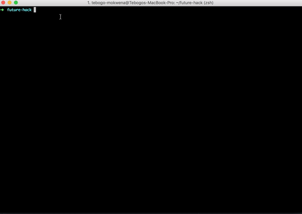

# Future Hack 2017 application
### Welcome to the Future Hack 2017 Application powered by McKinsey & Company in partnership with Facebook and Generation

### What is Future Hack?
Future Hack is a programme by McKinsey Digital Africa in partnership with Facebook for Developers and Generation (https://www.generationinitiative.org/about/). The aim of this programme is to get young South African students to start thinking of a way to use technology to solve social problems with an innovative and entrepreneurial mindset in a hackathon fashion over a weekend after which the winners will win an all expense paid trip to the Facebook F8 conference in the Silicon Valley in 2018.
The selected applicants will be invited to a weekend hackathon challenge in Johannesburg on the 13 - 15th October 2017 where they will be solving for the same problem of unemployment which Generation is trying to solve, using technology.

### How do I apply for Future Hack?
We're assuming you've landed here because you're trying to complete the application coding + problem solving challenge which is step 1 to the process:
 - [x] The coding + problem solving challenge here is for you to think of any social problem in South Africa which you'd like to solve(e.g quality of education, crime, health etc.).
 - [x] Fork this repository and use it as your work space for the challenge. For more information on how to do this on github: https://help.github.com/articles/fork-a-repo/ 
  - [x] Describe how you would solve this problem using technology in your README file.
  - [x] Now build an MVP (Minimum viable Product) website of your solution using the skeleton app (Skeleton style guide: http://getskeleton.com) as a library of styling options for you to use but feel free to use any other framework you wish. Please note that this is a vital element to determine success in the application form so please be articulate in describing your solution to the problem you've chosen. The MVP doesn't not need to be more than a day's work; nothing complicated as long as it can clearly depict the problem and solution.
  - [x] Commit all your work to this forked git repository and to make sure it's pushed to your master. Use the Git introduction as a guideline here: https://help.github.com/articles/adding-a-file-to-a-repository-using-the-command-line/
  A short demo of how to commit and push to master: 
  
  - [x] Final step is for you to host your application using Github pages so we can view it live (please include the link to your live app in your README file). For more information on how to use Github Pages https://pages.github.com/

### Now it's time to complete the application form as the final step: 
- https://mck-forms.typeform.com/to/iSp2Yn

The team is super excited to see you cool MVP :) 
### References:
- Skeleton is what we used as the skeleton app: http://getskeleton.com
- Learn more about git: https://git-scm.com/docs/gittutorial
- Learn more about Mckinsey Digital: http://www.mckinsey.com/business-functions/digital-mckinsey/how-we-help-clients/digital-labs
- Learn more about Facebook F8: https://www.fbf8.com/
- Learn more about Generation: https://www.generationinitiative.org
