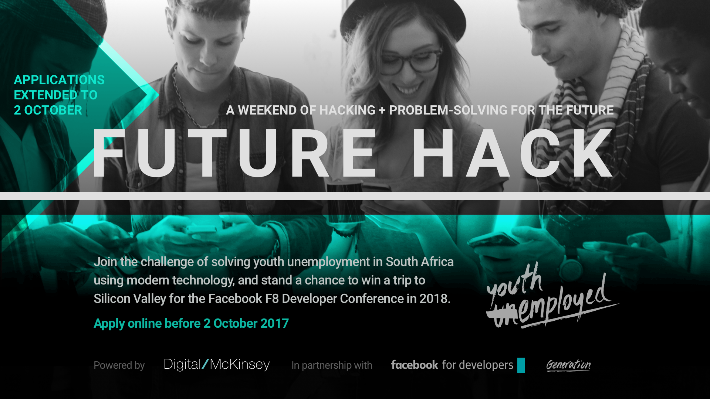

# Future Hack 2017 application
### Welcome to the Future Hack 2017 Application powered by McKinsey & Company in partnership with Facebook and Generation

## What is Future Hack?
Future Hack is a hackathon organised by [Digital McKinsey](http://www.mckinsey.com/business-functions/digital-mckinsey/how-we-help-clients/digital-labs) in partnership with [Facebook for Developers](https://developers.facebook.com/) and [Generation](https://www.generationinitiative.org/). The aim of this hackathon is to get **final year undergraduate / postgraduate South African students** thinking about ways in which they can play a role in solving societal problems using technology.

## How will Future Hack work?
In pure hackathon fashion, Future Hack will take place over a weekend of non-stop learning, problem solving and 'hacking' in Johannesburg on the 13 - 15th October 2017. Participants will spend the weekend in teams using their innovative and entrepreneurial mindset to build a digital solution to a problem currently faced by [Generation](https://www.generationinitiative.org/about/) - a global social enterprise aimed at eradicating youth unemployment.

The team with the winning solution will be awarded an all expense paid trip to the [Facebook F8 conference 2018](https://www.fbf8.com/) hosted in Silicon Valley.

## How do I apply for Future Hack?
In order to be invited to Future Hack you will have to complete the Future Hack problem solving, coding challenge and application form. **Please complete the following three steps in the order they are presented**.

### 1. Problem solving challenge
 - Describe a societal problem in South Africa (e.g quality of education, crime, health etc.) and how you would solve this problem with the use of technology in no more than 100 words.
 - Your description of this problem and solution must be submitted in Section 3 of this application.
 - Ensure that the solution you come up with is in the form of a software or hardware product.
 - The significance of the problem as well as the impact and innovation of your solution will be crucial in our evaluation of your application for the hackathon.
 - Please note that this is a vital element to determine success in the application form so please be articulate in describing your solution to the problem you've chosen.

### 2. Coding challenge
 - Build a single page website that advertises the solution you proposed in the problem solving challenge above.
 - Ensure that your website describes the problem you identified and how the solution you proposed would solve it.
 - Note that the visual design and functionality of the website will be crucial in our evaluation of your application for the hackathon.
 - This website can only be built using [HTML](https://www.w3schools.com/html/default.asp), [CSS](https://www.w3schools.com/css/default.asp) and vanilla [Javascript](https://www.w3schools.com/js/default.asp) **OR** [React JS](https://facebook.github.io/react/).
 - You can use boilerplates such as [Skeleton](http://getskeleton.com) for your project - this is free.
 - Store your codebase on your own public [GitHub repository](https://github) - this is free.
 - Host your application using [Github Pages](https://pages.github.com/) so that we can view it live - this is free.
 - We are super excited to see your cool MVP :)

#### Now that you're done with the Problem Solving and Coding Challenges, please share your solution with us by completing the Application form below.

### 3. Application form
 - Complete the Future Hack [application form](https://mck-forms.typeform.com/to/iSp2Yn) only once you have completed the Future Hack coding challanges above.

## References:

#### Our organisers
- Learn more about Digital Mckinsey: http://www.mckinsey.com/business-functions/digital-mckinsey/how-we-help-clients/digital-labs
- Learn more about Facebook for Developers: https://developers.facebook.com/
- Learn more about Generation: https://www.generationinitiative.org/about/

#### The tools we use
- Learn more about Git & GitHub: https://thenewboston.com/videos.php?cat=70		  
- Learn more about HTML, CSS and Javascript: https://www.w3schools.com/
- Learn more about React JS: https://www.youtube.com/playlist?list=PL6gx4Cwl9DGBuKtLgPR_zWYnrwv-JllpA
- Learn more about Skeleton: http://getskeleton.com
- Learn more about GitHub Pages: https://pages.github.com/documentation
